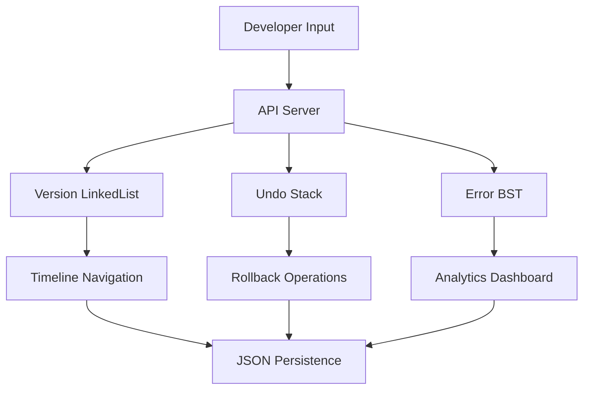

<div align="center">

# 🛠️ Code Evolution Tracker

### *Track. Undo. Learn. Debug Smarter.*

[](https://www.java.com/)
[](https://developer.mozilla.org/en-US/docs/Web/JavaScript)
[](https://html.spec.whatwg.org/)
[](https://www.w3.org/Style/CSS/)

**A lightweight developer assistance tool that leverages Stack, Linked List & Binary Search Tree to revolutionize debugging workflow**

[Features](#-features) • [Quick Start](#-quick-start) • [Architecture](#-architecture) • [Demo](#-demo)

---

</div>

## 🎯 Problem Statement

During debugging sessions, developers face critical challenges:

```
❌ Lost track of what changes were made
❌ Unable to quickly revert to working states
❌ No insight into recurring error patterns
❌ Manual debugging history management
```

**Solution**: An intelligent timeline tool powered by fundamental data structures that transforms debugging from chaos to clarity.

---

## ✨ Features

<table>
<tr>
<td width="33%" align="center">

### 📜 Smart Timeline
**Linked List Implementation**

Chronological debugging history with bidirectional navigation through code versions

</td>
<td width="33%" align="center">

### ⏮️ Instant Undo
**Stack-Based Operations**

LIFO-powered version control with one-click rollback capability

</td>
<td width="33%" align="center">

### 📊 Error Analytics
**BST-Powered Insights**

Automatic error frequency tracking with sorted visualization

</td>
</tr>
</table>

---

## 🚀 Innovative Capabilities

### 💡 Innovation #1: Bug-Free Version Recovery

```java
// Mark current state as stable
version.markAsBugFree();

// Instantly revert to last known good state
timeline.revertToLastBugFreeVersion();
```

**Impact**: Eliminates the "broken code" anxiety by maintaining safety checkpoints.

### 💡 Innovation #2: Pattern Recognition Engine

```java
// Automatic error categorization
errorBST.insert("NullPointerException");
errorBST.insert("SyntaxError");

// Identify your most common mistakes
String topError = errorBST.findMostFrequent();
```

**Impact**: Transforms errors from frustrations into learning opportunities.

---

## 🏗️ Architecture

<div align="center">



</div>

### 🧩 Data Structure Rationale

| Structure | Purpose | Justification |
|-----------|---------|---------------|
| **Linked List** | Debugging timeline | O(1) insertion, efficient bidirectional traversal |
| **Stack** | Undo mechanism | LIFO perfect for revert operations |
| **Binary Search Tree** | Error frequency | O(log n) search, in-order sorted traversal |

---

## 📁 Project Structure

```
code-debugging-timeline/
│
├── 📂 src/
│   ├── 📂 app/
│   │   └── ApiServer.java          # HTTP server & REST endpoints
│   ├── 📂 ds/
│   │   ├── VersionLinkedList.java  # Timeline implementation
│   │   ├── VersionNode.java        # List node structure
│   │   ├── UndoStack.java          # Undo operations
│   │   ├── ErrorBST.java           # Error analytics
│   │   └── ErrorNode.java          # BST node structure
│   └── 📂 model/
│       └── Version.java            # Core data model
│
└── 📂 web/
    ├── index.html                  # UI interface
    ├── style.css                   # Styling
    └── app.js                      # Frontend logic
```

---

## ⚡ Quick Start

### Prerequisites

```bash
☑️ Java JDK 11+ (with jdk.httpserver module)
☑️ Python 3.x (for frontend server)
☑️ Modern web browser
```

### Installation & Running

**1️⃣ Clone the Repository**
```bash
git clone https://github.com/yourusername/code-debugging-timeline.git
cd code-debugging-timeline
```

**2️⃣ Start Backend Server**
```bash
# Compile
javac --add-modules jdk.httpserver -d out src/app/ApiServer.java src/ds/*.java src/model/*.java

# Run
java --add-modules jdk.httpserver -cp out app.ApiServer
```

**3️⃣ Launch Frontend**
```bash
cd web
python -m http.server 5501
```

**4️⃣ Open Browser**
```
http://127.0.0.1:5501
```

---

## 🎮 Demo

<div align="center">

### Typical Workflow

```
1. Save Debugging Step → 2. Make Changes → 3. Error Occurs → 4. Undo or Revert
```

**Example Session:**
```javascript
// Step 1: Save initial state
saveVersion("Fixed login validation", "No errors");

// Step 2: Make risky changes
saveVersion("Refactored auth logic", "Testing...");

// Step 3: Error discovered
saveVersion("Database connection", "NullPointerException");

// Step 4: Instant rollback
undo(); // Back to working state
```

</div>

---

## 🎓 Academic Context

> **Course**: Programming, Data Structures & Algorithms (PDSA)  
> **Focus**: Practical application of fundamental data structures  
> **Category**: Developer Tool (not a full system)

### Learning Outcomes Demonstrated

- ✅ Real-world application of Stack, Linked List, and BST
- ✅ Algorithm design for debugging workflows
- ✅ Time/space complexity optimization
- ✅ RESTful API architecture
- ✅ Frontend-backend integration

---

## 🔬 Technical Highlights

### Algorithm Efficiency

```
Operation              | Time Complexity | Space Complexity
-----------------------|-----------------|------------------
Add Version            | O(1)            | O(n)
Undo Operation         | O(1)            | O(n)
Find Bug-Free Version  | O(n)            | O(1)
Insert Error           | O(log n) avg    | O(n)
Most Frequent Error    | O(n)            | O(1)
```

### Key Implementation Details

- **Persistent Storage**: JSON-based version history
- **Memory Management**: Efficient node-based structures
- **Concurrency**: Thread-safe HTTP server
- **Error Handling**: Comprehensive exception management

---

## 🛣️ Roadmap

- [ ] Add visual timeline graph
- [ ] Implement diff viewer between versions
- [ ] Export debugging reports as PDF
- [ ] Add collaborative debugging features
- [ ] Machine learning for error prediction

---

## 🤝 Contributing

Contributions are welcome! Please feel free to submit a Pull Request.

1. Fork the repository
2. Create your feature branch (`git checkout -b feature/AmazingFeature`)
3. Commit your changes (`git commit -m 'Add AmazingFeature'`)
4. Push to branch (`git push origin feature/AmazingFeature`)
5. Open a Pull Request

---

## 📄 License

This project is created for academic purposes as part of PDSA coursework.

---

<div align="center">

## 👨‍💻 Author

**[Your Name]**  
*Computer Science Student*

[](https://github.com/yourusername)
[](https://linkedin.com/in/yourusername)

---

### ⭐ If this project helped you, please give it a star!

**Made with ❤️ and data structures**

</div>
